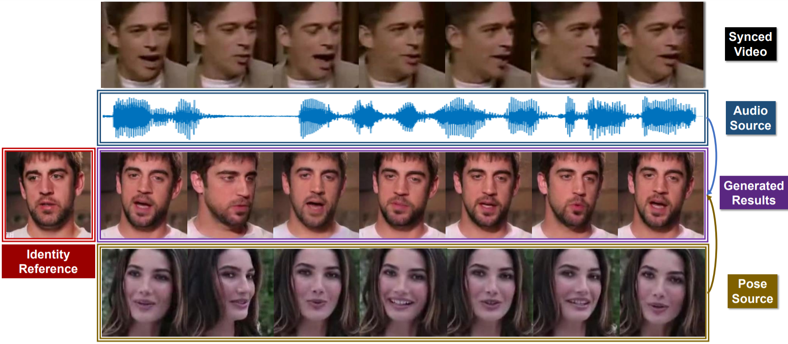

# Pose-Controllable Talking Face Generation by Implicitly Modularized Audio-Visual Representation

we present `Pose-Controllable AudioVisual System (PC-AVS)`, which achieves free pose control
when driving arbitrary talking faces with audios.

[[Project]](https://liuziwei7.github.io/projects/TalkingFace) [[Paper]](https://arxiv.org/abs/1807.07860) [[Demo]](https://www.youtube.com/watch?v=-J2zANwdjcQ)

[comment]: <> ()


## Requirements
* [python 3.6](https://www.python.org/downloads/)
* [PyTorch](https://pytorch.org/) (We use version 1.3.1)

## Generate test results
* Download the pre-trained model [checkpoint](https://drive.google.com/file/d/1Zehr3JLIpzdg2S5zZrhIbpYPKF-4gKU_/view?usp=sharing)
``` bash
Create the default folder "checkpoints" and put the checkpoint in it
```

* Run demo scripts
``` bash
bash experiments/demo_vox.sh
```


## Train your own model
* Coming soon

## License and Citation
The use of this software is RESTRICTED to **non-commercial research and educational purposes**.

```
@inproceedings{zhou2021talking,
 title     = {Pose-Controllable Talking Face Generation by Implicitly Modularized Audio-Visual Representation},
 author    = {Hang Zhou, Yasheng Sun, Wayne Wu, Chen Change Loy, Xiaogang Wang, Ziwei Liu},
 booktitle = {IEEE/CVF Conference on Computer Vision and Pattern Recognition (CVPR)},
 year      = {2021},
}
```

## Acknowledgement
The structure of this codebase is borrowed from [pix2pix](https://github.com/junyanz/pytorch-CycleGAN-and-pix2pix).
