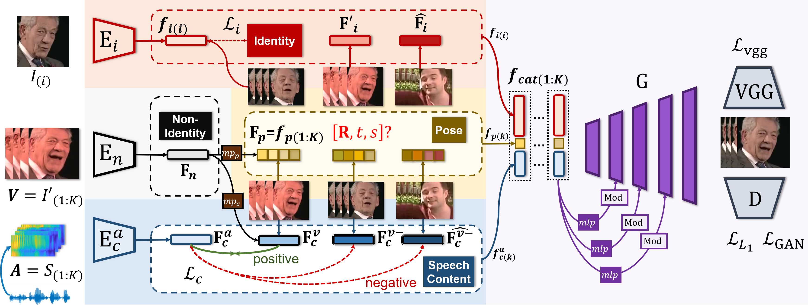

# Pose-Controllable Talking Face Generation by Implicitly Modularized Audio-Visual Representation (CVPR 2021)

[Hang Zhou](https://hangz-nju-cuhk.github.io/), Yasheng Sun, [Wayne Wu](https://wywu.github.io/), [Chen Change Loy](http://personal.ie.cuhk.edu.hk/~ccloy/), [Xiaogang Wang](http://www.ee.cuhk.edu.hk/~xgwang/), and [Ziwei Liu](https://liuziwei7.github.io/).


### [Project](https://hangz-nju-cuhk.github.io/projects/PC-AVS) | [Paper](https://arxiv.org/abs/2104.11116) | [Demo](https://www.youtube.com/watch?v=lNQQHIggnUg)


We propose **Pose-Controllable Audio-Visual System (PC-AVS)**, 
which achieves free pose control when driving arbitrary talking faces with audios. Instead of learning pose motions from audios, we leverage another pose source video to compensate only for head motions.
The key is to devise an implicit low-dimension pose code that is free of mouth shape or identity information. 
In this way, audio-visual representations are modularized into spaces of three key factors: speech content, head pose, and identity information.



## Requirements
* Python 3.6 and [Pytorch](https://pytorch.org/) 1.3.0 are used. Basic requirements are listed in the 'requirements.txt'.

```
pip install -r requirements.txt
```


## Quick Start: Generate Demo Results
* Download the pre-trained [checkpoints](https://drive.google.com/file/d/1Zehr3JLIpzdg2S5zZrhIbpYPKF-4gKU_/view?usp=sharing).

* Create the default folder ```./checkpoints``` and 
unzip the ```demo.zip``` at ```./checkpoints/demo```. There should be 5 ```pth```s in it.

* Unzip all ```*.zip``` files within the ```misc``` folder.

* Run the demo scripts:
``` bash
bash experiments/demo_vox.sh
```


* The ```--gen_video``` argument is by default on, 
[ffmpeg](https://www.ffmpeg.org/) >= 4.0.0 is required to use this flag in linux systems. 
All frames along with an ```avconcat.mp4``` video file will be saved in the ```./id_517600055_pose_517600078_audio_681600002/results``` folder.


From left to right are the *reference input*, the *generated results*,
the *pose source video* and the *synced original video* with the driving audio.

## Prepare Testing Meta Data

* ### Automatic VoxCeleb2 Data Formulation

The inference code ```experiments/demo.sh``` refers to ```./misc/demo.csv``` for testing data paths. 
In linux systems, any applicable ```csv``` file can be created automatically by running:

```bash
python scripts/prepare_testing_files.py
```

Then modify the ```meta_path_vox``` in ```experiments/demo_vox.sh``` to ```'./misc/demo2.csv'``` and run

``` bash
bash experiments/demo_vox.sh
```
An additional result should be seen saved. 

* ### Metadata Details

Detailedly, in ```scripts/prepare_testing_files.py``` there are certain flags which enjoy great flexibility when formulating the metadata:

1. ```--src_pose_path``` denotes the driving pose source path.
It can be an ```mp4``` file or a folder containing frames in the form of ```%06d.jpg``` starting from  0.

2. ```--src_audio_path``` denotes the audio source's path. 
It can be an ```mp3``` audio file or an ```mp4``` video file. If a video is given, 
the frames will be automatically saved in ```./misc/Mouth_Source/video_name```, and disables the ```--src_mouth_frame_path``` flag.

3. ```--src_mouth_frame_path```. When ```--src_audio_path``` is not a video path, 
this flags could provide the folder containing the video frames synced with the source audio.

4. ```--src_input_path``` is the path to the input reference image. When the path is  a video file, we will convert it to frames.

5. ```--csv_path``` the path to the to-be-saved metadata.

You can manually modify the metadata ```csv``` file or add lines to it according to the rules defined in the ```scripts/prepare_testing_files.py``` file or the dataloader ```data/voxtest_dataset.py```.

We provide a number of demo choices in the ```misc``` folder, including several ones used in our [video](https://www.youtube.com/watch?v=lNQQHIggnUg).
Feel free to rearrange them even across folders. And you are welcome to record audio files by yourself.

* ### Self-Prepared Data Processing
Our model handles only **VoxCeleb2-like** cropped data, thus pre-processing is needed for self-prepared data.

To process self-prepared data [face-alignment](https://github.com/1adrianb/face-alignment) is needed. It can be installed by running
```
pip install face-alignment
```

Assuming that a video is already processed into a ```[name]``` folder  by previous steps through ```prepare_testing_files.py```, 
you can run 
```
python scripts/align_68.py --folder_path [name]
```

The cropped images will be saved at an additional ```[name_cropped]``` folder.
Then you can manually change the ```demo.csv``` file or alter the directory folder path and run the preprocessing file again.

## Train Your Own Model
* Not supported yet.

## License and Citation

The usage of this software is under [CC-BY-4.0](https://github.com/Hangz-nju-cuhk/Talking-Face_PC-AVS/LICENSE).
```
@InProceedings{zhou2021pose,
author = {Zhou, Hang and Sun, Yasheng and Wu, Wayne and Loy, Chen Change and Wang, Xiaogang and Liu, Ziwei},
title = {Pose-Controllable Talking Face Generation by Implicitly Modularized Audio-Visual Representation},
booktitle = {Proceedings of the IEEE Conference on Computer Vision and Pattern Recognition (CVPR)},
year = {2021}
}
```

## Acknowledgement
* The structure of this codebase is borrowed from [SPADE](https://github.com/NVlabs/SPADE).
* The generator is borrowed from [stylegan2-pytorch](https://github.com/rosinality/stylegan2-pytorch).
* The audio encoder is borrowed from [voxceleb_trainer](https://github.com/clovaai/voxceleb_trainer).
